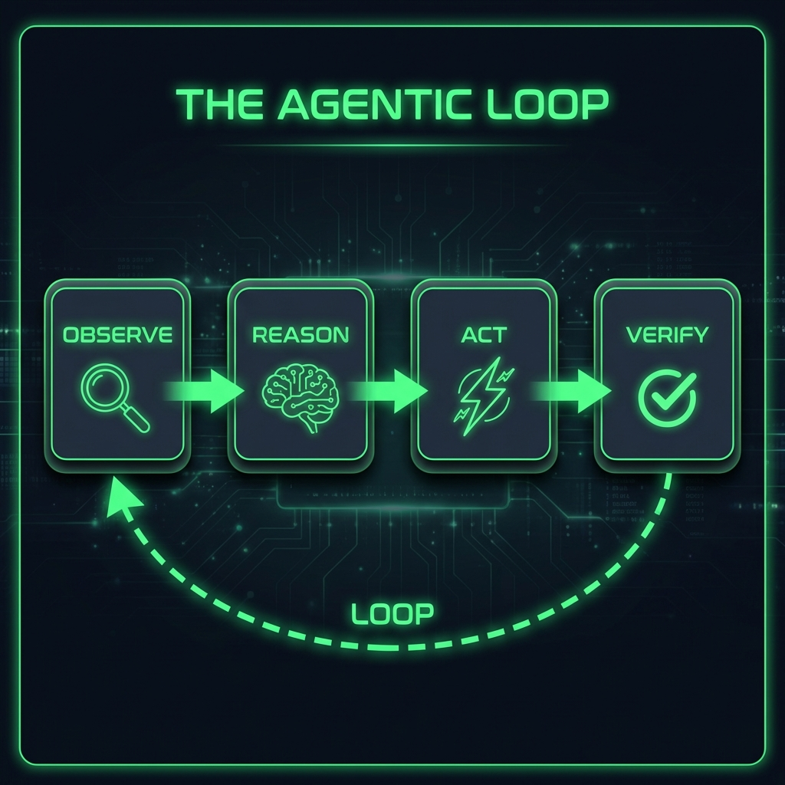
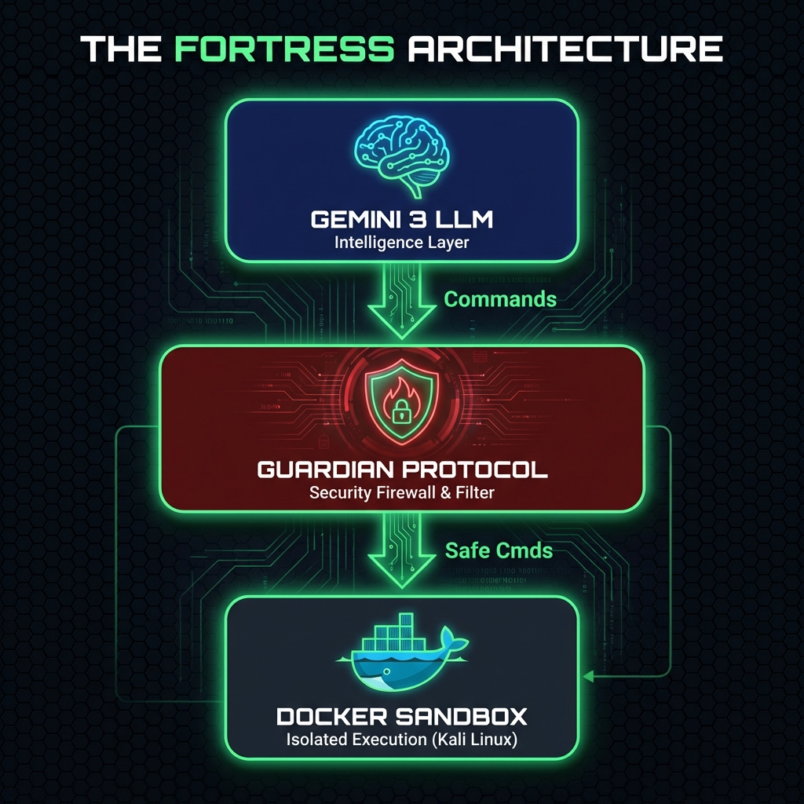

# 🛡️ PwnGPT: Autonomous CTF Solver
By Abdelali Saadali
Abdelbarie Rhayour
kawtar khallouf

PwnGPT is an advanced, agentic AI assistant designed to autonomously solve Capture The Flag (CTF) challenges. Built with **Streamlit**, **LangGraph**, and **Google Gemini**, it features a secure **Docker-based sandbox** to execute tools and analyze binaries safely.

## ✨ Features

- **🤖 Autonomous Agent**: Uses ReAct logic (Observe, Reason, Act, Verify) to solve challenges step-by-step.
- **🔒 Secure Sandbox**: All commands run inside a **Kali Linux** Docker container with strict resource limits (2GB RAM, 1 CPU, Read-Only Root).
- **🛡️ Guardian Protocol**: A security layer that blocks high-risk commands (e.g., `rm -rf`, accessing host files) before they execute.
- **🧠 Thinking Console**: Visualizes the AI's thought process, commands, and observations in real-time with syntax highlighting.
- **📦 Persistent Sessions**: Tools installed via `apt-get` persist throughout your session until you hit Reset.
- **📝 Professional Write-ups**: Generates detailed Markdown write-ups and exports them as **PDF (with branding)** or TXT.
- **📂 Intelligent "Artifact Gallery"**: A dedicated UI tab that lists generated payloads and files, allowing instant downloads.
- **📚 Knowledge Base Uploader**: Upload your own notes, write-ups, or cheat sheets (`.txt`, `.md`) directly via the Sidebar to feed the Agent's RAG memory.
- **🌐 Multimodal "Web-Eye"**: A browser integration that takes screenshots of target websites, allowing Gemini's vision model to analyze UI elements for vulnerabilities.
- **🧬 Multi-Agent Parallelism (Expert Panel)**: Spawns specialized sub-agents (Forensics, Web, Reverse Engineer) to debate strategies in parallel before the main agent acts.
- **🔁 Flag Validation Loop**: Automatically detects and decodes suspicious strings (like Base64) in tool output to find hidden flags that don't match standard formats immediately.
- **🛡️ Robust API Handling**: Implements smart rate-limiting and exponential backoff to handle free-tier API quotas (`429` errors) gracefully.
- **🛑 Human-in-the-Loop**: High-risk actions require your explicit approval via a "Big Red Button" UI.

## 🏗️ Architecture

### The Agentic Loop
PwnGPT uses a ReAct-style reasoning cycle to autonomously solve challenges:



### The Fortress Architecture
A layered security model ensures safe execution:



## 🚀 Installation

### Prerequisites
- **Python 3.10+**
- **Docker Desktop** (Must be running)
- **Google Gemini API Key**

### Setup
1. Clone the repository:
   ```bash
   git clone https://github.com/AbdelaliSaadali/PwnGPT.git
   cd PwnGPT
   ```

2. Install dependencies:
   ```bash
   pip install -r requirements.txt
   ```

3. Configure API Key:
   - Edit `brain.py` and set your `API_KEY` (or use environment variables).

## 🎮 Usage

1. Start the application:
   ```bash
   streamlit run app.py
   ```

2. **Configure the Session**:
   - Enter the **Challenge Name** and **Category** (WEB, PWN, REV, etc.).
   - Upload challenge files (zips, binaries, pcaps).
   - Providing **Hints** is optional but helps the agent.

3. **Initialize Agent**:
   - Click **🚀 INITIALIZE AGENT**.
   - The app will pull the `kalilinux/kali-rolling` Docker image (first time may take a minute).

4. **Monitor & Approve**:
   - Watch the **Thinking Console**.
   - If the agent needs to run a risky command (e.g. executing a binary), approve it in the sidebar.

5. **Solve & Reset**:
   - Once the flag is found, verify it.
   - Click **✅ Confirm** to generate a write-up.
   - Click **🗑️ RESET ENVIRONMENT** to wipe the sandbox and start fresh.

## ⚠️ Disclaimer

**PwnGPT is for EDUCATIONAL PURPOSES ONLY.**
Do not use this tool against targets you do not have explicit permission to test. The authors are not responsible for any misuse or damage caused by this software.

## 🛠️ Tech Stack
- **Frontend**: Streamlit
- **Backend/Logic**: LangGraph, LangChain
- **LLM**: Google Gemini 3 Flash / Pro
- **Sandbox**: Docker Engine (Kali Linux)
